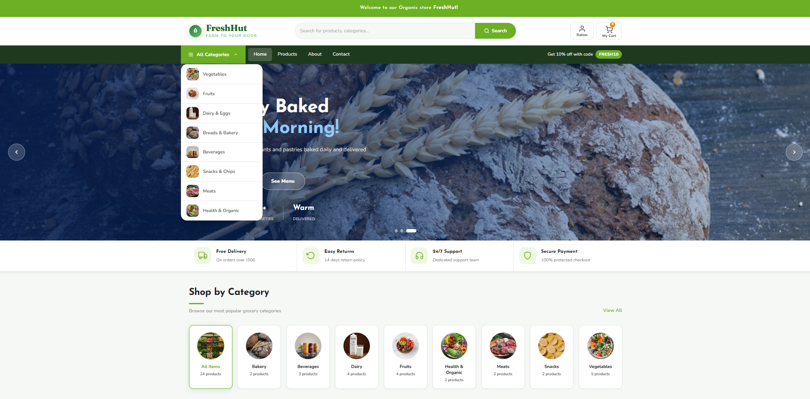
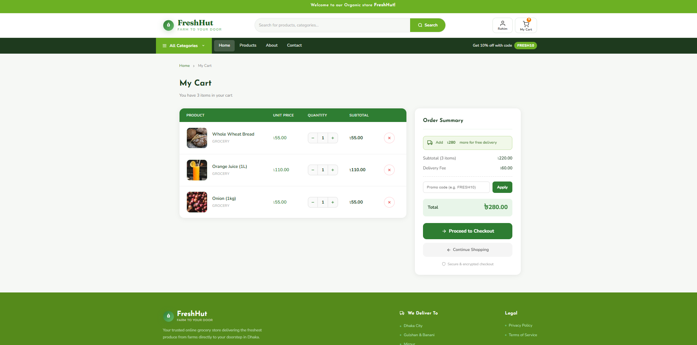
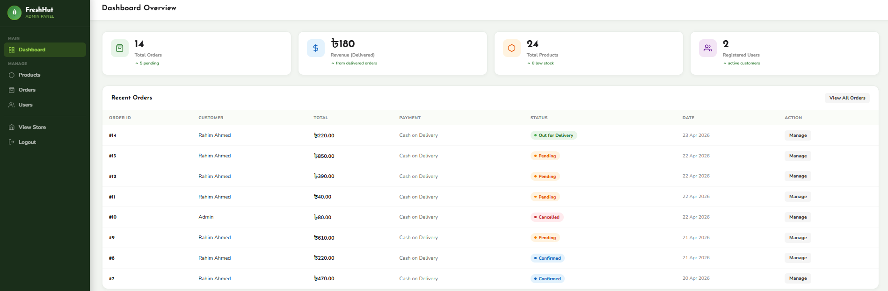

# 🛒 FreshHut — Online Grocery Store

*A full-stack grocery ordering platform focused on speed and simplicity — pick your items, drop them in the cart, check out, and watch the order move all the way to your doorstep. Built for shoppers who want a clean, no-fuss experience from browsing to delivery.*


## Table of Contents

| Section | Section | Section |
|---|---|---|
| [Live Demo](#live-demo) | [Project Structure](#project-structure) | [Environment Variables](#environment-variables) |
| [Features](#features) | [Database Schema](#database-schema) | [Authentication and Security](#authentication-and-security) |
| [Screenshots](#screenshots) | [Application Flow](#application-flow) | [Demo Accounts](#demo-accounts) |
| [Tech Stack](#tech-stack) | [Local Setup](#local-setup) | [Contributing](#-contributing) · [License](#-license) · [Contact](#-contact) |

<h2 id="live-demo" align="center">Live Demo</h2>

<div align="center">


<br/>

<a href="https://freshhut-grocery.onrender.com/">
  
</a>

</div>

<p align="center">
  <sub>⏳ <b>Heads up:</b> the app is hosted on Render's free plan, so it goes to sleep after inactivity. If nobody's visited recently, give the first load 30–50 seconds to wake the server back up.</sub>
</p>

## Features

**Customer Side**
- 🔐 Sign up and log in through PHP session authentication
- 🛍️ Browse the catalog with category filters, live search, and a highlighted-products carousel
- 🛒 Cart with adjustable quantities and live stock checks
- 💳 Choose from four ways to pay — Cash on Delivery, bKash, Nagad, or Rocket
- 📦 Watch orders move through a live status timeline (`Pending → Confirmed → Processing → Out for Delivery → Delivered`)
- 👤 Update your details and look back at past orders from your profile

**Admin Side**
- 📊 A dashboard summarizing revenue, order counts, product totals, and low-stock warnings
- 🥕 Full control over the catalog — create, edit, remove, and attach images to products
- 📋 Inspect any order's details and move it through its status stages
- 👥 Manage the user base — review accounts, adjust roles, or remove them entirely

## Screenshots

<table>
  <tr>
    <td align="center"><b>Create Account</b><br></td>
    <td align="center"><b>Shopping Cart</b><br></td>
  </tr>
  <tr>
    <td align="center"><b>Order Tracking</b><br></td>
    <td align="center"><b>Admin Dashboard</b><br></td>
  </tr>
  <tr>
    <td align="center" colspan="2"><b>Admin — Manage Products</b><br></td>
  </tr>
</table>

## Tech Stack

| Layer | Technology | Purpose |
|---|---|---|
| Frontend | HTML5 | Builds the page structure and markup |
| Styling | CSS3 | Handles layout, cards, forms, and the admin theme |
| Client-side | Vanilla JavaScript | Drives search, filters, cart actions, checkout, and tracking via Fetch |
| Backend | PHP 8.2 | Runs auth, business rules, and the REST-style endpoints |
| Database | MySQL | Holds users, categories, products, carts, and orders |
| API Communication | Fetch API / JSON | Links the browser to the PHP backend |
| Web Server | Apache | Hosts the PHP app (`php:8.2-apache` image) |
| Containerization | Docker | Bundles the app for consistent deployment |
| Hosting | Render | Runs the deployed container |
| Database Service | Aiven (MySQL) | Cloud-hosted database reachable over SSL |

## Project Structure

```
Grocery-Store1/
├── admin/
│   ├── index.html
│   ├── products.html
│   ├── orders.html
│   ├── users.html
│   └── admin-style.css
│
├── api/
│   ├── auth_check.php
│   ├── cart.php
│   ├── login.php
│   ├── logout.php
│   ├── orders.php
│   ├── products.php
│   ├── register.php
│   ├── user.php
│   └── users.php
│
├── user/
│
├── config/
│   ├── db.php
│   ├── ca.pem
│   └── grocery_store.sql
│
├── css/
│   ├── style.css
│   └── product-detail.css
│
├── js/
│   ├── admin.js
│   ├── auth.js
│   ├── cart.js
│   ├── checkout.js
│   ├── main.js
│   └── product-img.js
│
├── uploads/
│   └── products/
│
├── about.html
├── cart.html
├── checkout.html
├── contact.html
├── index.html
├── login.html
├── product-detail.html
├── products.html
├── register.html
├── tracking.html
├── Dockerfile
└── entrypoint.sh
```

## Database Schema

Tables are built and populated the first time the app runs (handled in `config/db.php`), so there's no SQL file to import by hand.

| Table | Purpose |
|---|---|
| `users` | Holds account details, contact info, roles, and login credentials for customers and admins |
| `categories` | Lists the 8 grocery categories — Vegetables, Fruits, Dairy, Bakery, Beverages, Snacks, Meats, Health & Organic |
| `products` | Stores product name, category, price, stock count, description, and image (24 items seeded) |
| `cart` | Tracks what each customer currently has in their basket |
| `orders` | Captures order-level info — delivery address, payment choice, total, and current status |
| `order_items` | Records the specific products, quantities, and prices tied to each order |

Relationships between these tables are enforced with foreign keys.

## Application Flow

### Customer Flow

```
Register / Login
       │
       ▼
Browse Products
       │
       ├── Search
       └── Filter by Category
       │
       ▼
Add to Cart
       │
       ▼
Checkout
       │
       ├── Delivery Address
       └── Payment Method
       │
       ▼
Place Order
       │
       ▼
Pending
  ↓
Confirmed
  ↓
Processing
  ↓
Out for Delivery
  ↓
Delivered
```

### Admin Flow

```
Admin Login
    │
    ▼
Admin Dashboard
    ├── Manage Products
    ├── Manage Orders
    └── Manage Users
```

## Local Setup

### Prerequisites
- [XAMPP](https://www.apachefriends.org/) (bundles PHP, MySQL, and Apache together)

### Running the App with XAMPP

1. **Install XAMPP**, then launch the Control Panel and start the **Apache** and **MySQL** services.

2. **Pull the repo into your `htdocs` directory**
   ```bash
   cd C:/xampp/htdocs        # or /Applications/XAMPP/htdocs on Mac
   git clone <this-repo-url>
   cd Grocery-Store1
   ```

3. **Set up a database**
   - Head to `http://localhost/phpmyadmin`
   - Create a new database — `grocery_store` works fine

4. **Point the app at your database**
   Edit `config/db.php` and set the fallback values to match your local environment (typical XAMPP defaults):
   ```php
   DB_HOST = "localhost"
   DB_USER = "root"
   DB_PASS = ""              // XAMPP ships with no MySQL password by default
   DB_NAME = "grocery_store"
   DB_PORT = 3306
   ```

5. **Open the app in your browser**
   ```
   http://localhost/Grocery-Store1/
   ```
   On the first request, the app automatically creates its tables and seeds sample data — an admin account, a demo customer, categories, and products.

## Environment Variables

| Variable | Description |
|---|---|
| `DB_HOST` | MySQL host |
| `DB_USER` | MySQL username |
| `DB_PASS` | MySQL password |
| `DB_NAME` | Database name |
| `DB_PORT` | MySQL port |
| `PORT` | Port Apache listens on (set automatically by Render) |

## Authentication and Security

* Passwords are never stored in plain text — they're hashed.
* Login state is maintained through PHP sessions.
* Session cookies are locked down with secure attributes.
* Order data is scoped so customers can only see their own history.
* Every admin-only action is verified server-side before it runs.
* Stock levels are checked during both cart updates and checkout.
* All database queries go through prepared statements.
* Checkout wraps stock, order, and cart changes in a single transaction so nothing gets out of sync.
* DB credentials are meant to be passed in as environment variables, not hardcoded.
* SSL connections to MySQL are supported using the bundled CA certificate.

## Demo Accounts

Two accounts are already seeded on the live demo so you can jump straight into either role:

| Role | Email | Password |
|---|---|---|
| Admin | `admin@freshhut.com` | `FreshHut_Admin_2026!` |
| Customer | `customer@test.com` | `customer123` |

---

## 🤝 Contributing

Got an idea to make this better? Fork the repo, make your changes, and open a pull request.

---

## 🔒 License

Released under the [MIT License](./LICENSE).

---

## 📧 Contact

Questions or feedback are welcome — reach out at imam220826@gmail.com
